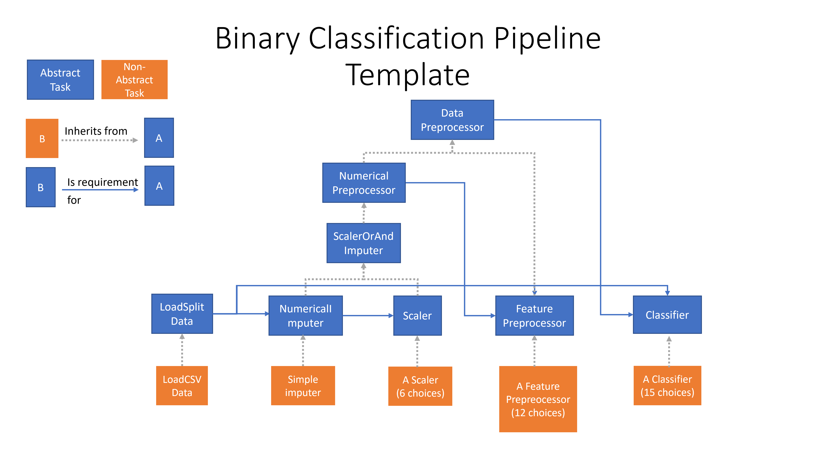

# cls-luigi-paper


This repository contains the official implementation of the examples in the paper:
[CLS-Luigi: A library for automatic analytics pipelines generation](https://i.pinimg.com/474x/fc/27/fb/fc27fb16e1e692e07f8bb3764dfc633b.jpg)

```
@article{meyer2024clsluigi,
  title={CLS-Luigi: A library for automatic analytics pipelines generation},
  author={},
  journal={},
  year={2024}
}
``` 

## Python virtual environments and dependencies

Note that we used two separate virtual environments to execute the examples in this repository. This is because Auto-Sklearn doesn't support Python> 3.9 while CLS-Luigi requires Python 3.11.

for running the examples `automl_pipelines/` & `decision_pipeline/` directories we used Python 3.11.6. You may install the dependencies as follows: 

```
git clone --branch MPC https://github.com/khalil-research/PyEPO.git
pip install PyEPO/pkg/.

pip install -r requirements.txt
```

For running the example in "auto-sklearn" directory we used Python 3.8.18. You may install the library "Auto-Sklearn" as follows:

```
pip install auto-sklearn==0.15.0
```
If you are having problems with downloading Auto-Sklearn, please consult their [Github-Repository](https://github.com/automl/auto-sklearn)


## Running the decision pipelines example

````
cd decision_pipelines
python main.py
python gather_scores_and_plot.py
````
IMPORTANT: The resulting pipelines are designed to handle only binary-classification problems with numerical features!

### Pipelines outputs and regret comparison graph.
Once completed, you may find the results of all runs under `decision_pipelines/results/` directory.

The `decision_pipelines/scores_and_plots/` directory contains all scores and regret comparison graph. 


## Running the automl pipelines example

<p align="center"></p>

To run the automl example, use the following commands: 
````
cd automl_pipelines
python main.py
````

If you face a PermissionError you may need to change the ownership of the `/var/log/` directory as follows:

````
sudo chmod a+rwx /var/log/
````

### Pipeline outputs and dataset splitting
Once completed, you can find the outputs of all pipelines in the `automl_pipelines/results/` directory.

Sub-directories **without** "incumbent" in the name contain the outputs of the train phase, with all pipelines: 

- fitted on `/datasets/DATASET_NAME/train_phase/x_train.csv` & `/datasets/DATASET_NAME/train_phase/y_train.csv `
- and validated on `/datasets/DATASET_NAME/train_phase/x_valid.csv` & `/datasets/DATASET_NAME/train_phase/y_valid.csv`

While directories **with** "incumbent" in the name contain the outputs of the test phase with best pipeline:

- fitted on `/datasets/DATASET_NAME/test_phase/x_train.csv` & `/datasets/DATASET_NAME/test_phase/y_train.csv `
- and validated on `/datasets/DATASET_NAME/test_phase/x_test.csv` & `/datasets/DATASET_NAME/test_phase/y_test.csv`

Note that that datasets are downloaded from openml and split as follows: 

    /datasets
        /DATASET_NAME
            |--- /train_phase
                |--- x_train.csv
                |--- x_valid.csv
                |--- y_train.csv
                |--- y_valid.csv
            |--- /test_phase
                |--- x_train.csv
                |--- y_train.csv
                |--- x_test.csv
                |--- y_test.csv

The `/test_phase` directory, the training data comprises the entirety of the data in `/train_phase` directory. 

### Run history
You can find the run history of all runs in the `automl_pipelines/run_histories/` directory. 

### Logs
You can find the logs of all runs in the `automl_pipelines/logs/` directory.

The `luigi-root.log` file contains the warnings that occurred during all runs. Note that the `luigi-interface.log` file may be too big to open, as it contains all the outputs during all runs. 


## Experiment Hardware

All experiments were run on a machine with the following specifications:

|          |                                    |
|----------|------------------------------------|
| __OS__   | Manjaro Linux 23.1.0 Vulcan        |
| __CPU__  | Intel(R) Xeon(R) w5-2445 x86_64    |
| __GPUs__ | 2 x NVIDIA RTX 6000 Ada Generation |
| __RAM__  | ~131.5 GB                          |

