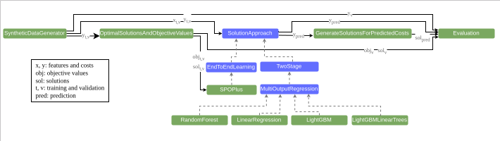

# CLS-Luigi Examples


This repository contains the official implementation of the examples in the paper:
[CLS-Luigi: A library for automatic analytics pipelines generation](https://i.pinimg.com/474x/fc/27/fb/fc27fb16e1e692e07f8bb3764dfc633b.jpg)

```
@article{meyer2024clsluigi,
  title={CLS-Luigi: A library for automatic analytics pipelines generation},
  author={},
  journal={},
  year={2024}
}
```

If you are looking for the CLS-Luigi Github Page, please visit this [repository](https://github.com/cls-python/cls-luigi).

## Installation

***Note that we used two separate virtual environments to execute the examples in this repository. This is because Auto-Sklearn doesn't support Python > 3.9 while CLS-Luigi requires Python >= 3.10.***

### CLS-Luigi Python Virtual Environment
for running the examples `binary_classfication_pipelines/`, `shortest_path_pipelines/` & `iris_pipelines/` directories we used Python 3.11. After creating a virtual environment you may install the dependencies as follows:

```
# clone and install PyEPO
git clone --branch MPC https://github.com/khalil-research/PyEPO.git
pip install PyEPO/pkg/.

# install all other requirements including CLS-Luigi
pip install -r requirements.txt
```
Note that running shortest path example requires a Gurobi license. Consult [Gurobi website](https://www.gurobi.com/) to acquire and install your license on your machine.


### AutoSklearn Python Virtual Environment

For running the example in `askl/` directory we used Python 3.8. You may install the library "Auto-Sklearn" as follows:

```
# install Auto-Sklearn
pip install auto-sklearn==0.15.0
```
If you are having problems with downloading Auto-Sklearn, please consult their [Github-Repository](https://github.com/automl/auto-sklearn)

## Running the iris example

<p align="center"></p>
To run this example, use the following commands:

````
cd iris_pipelines
python main.py
````


## Running the shortest path example
<p align="center"></p>
To run this example, use the following commands:

````
cd shortest_path_pipelines
python main.py
````
### Pipelines outputs and regret comparison graph.
After running the pipelines, you can find the outputs of the pipeline in the `shortest_path_pipelines/results/` directory.

The regret score for each pipeline and the regret comparison graph will be saved automatically in the `shortest_path_pipelines/scores_and_plots/` directory.

## Running the binary classification example

<p align="center"></p>

To run this example, use the following commands:
````
cd binary_classfication_pipelines

# downloads the dataset from openml and executes the pipelines
python main.py -- ds_id 9957 # dataset qsar-biodeg
python main.py --ds_id 359958 # dataset pc4
 ...
 ...
````
To replicate the results in the paper, run `python.main` for all datasets ids:

| Dataset | OpneML ID                          |
|------|------------------------------------|
| higgs | 146606                             |
| numerai28.6  |    167120                             |
| mozilla4 | 3899 |
| eeg-eye-state | 9983                               |
| bank-marketing | 361066                             |
| phoneme |    9952                             |
| sylvine | 359972 |
| wilt | 146820                               |
| spambase | 43                             |
| madelon  |    9976                             |
| ozone-level-8hr  | 9978 |
| kc1 | 359962                               |
| steel-plates-fault | 9967                             |
| pc4 |    359958                             |
| qsar-biodeg | 9957 |


IMPORTANT: The resulting pipelines are designed to handle only binary-classification problems with numerical features!


### Pipeline outputs and dataset splitting
Once completed, you can find the outputs of pipeline components in the `binary_classfication_pipelines/results/` directory.

Sub-directories **without** "incumbent" in the name contain the outputs of the train phase, with all pipelines:

- fitted on `/datasets/DATASET_NAME/train_phase/x_train.csv` & `/datasets/DATASET_NAME/train_phase/y_train.csv `
- and validated on `/datasets/DATASET_NAME/train_phase/x_valid.csv` & `/datasets/DATASET_NAME/train_phase/y_valid.csv`

While directories **with** "incumbent" in the name contain the outputs of the test phase with best pipeline:

- fitted on `/datasets/DATASET_NAME/test_phase/x_train.csv` & `/datasets/DATASET_NAME/test_phase/y_train.csv `
- and validated on `/datasets/DATASET_NAME/test_phase/x_test.csv` & `/datasets/DATASET_NAME/test_phase/y_test.csv`

Note that that datasets are downloaded automatically from openml and split as follows:

    /datasets
        /DATASET_NAME
            |--- /train_phase
                |--- x_train.csv
                |--- x_valid.csv
                |--- y_train.csv
                |--- y_valid.csv
            |--- /test_phase
                |--- x_train.csv
                |--- y_train.csv
                |--- x_test.csv
                |--- y_test.csv

In the `/test_phase` directory, the training data comprises the entirety of the data in `/train_phase` directory.

### Encoded pipelines
When running the example, the encoded pipelines are saved in the `binary_classfication_pipelines/json_pipelines/` directory.


### Run history
After running all pipelines, a run history CSV file is created and it contains all executed pipelines and their scores. The CSV-files can be found in`binary_classfication_pipelines/run_histories/` directory.

### Logs
After running all pipelines, you cab find in the `binary_classfication_pipelines/logs/` directory files about:

- elapsed seconds for training and testing all pipelines per dataset (JSON)
- best found pipelines and their scores for training and testing per dataset (JSON)
- elapsed seconds for synthesizing all pipelines  (JSON)
- elapsed seconds for decoding all pipelines per dataset, since synthesis occurs only once (JSON)
- summary of best-performing pipelines and their test scores (CSV)
- Luigi logs (TXT)
### Inhabitation Rules
Inhabitation rules are saved as a txt file at `binary_classfication_pipelines/inhabitation_rules.txt`.

## Running Auto-Sklearn example
This example should be only run after running the example in `/binary_classfication_pipelines`. This is because:

- Allocated time for Auto-Sklearn is decided based on the time taken to run the the binary classification pipelines in CLS-Luigi (per dataset)
- Datasets are downloaded and splitted only when running the binary classification pipelines.

To run this example, use the following commands:
````
cd askl
python main.py
````
Once completes, you can find the outputs of the pipeline in the `askl/results/` directory. We also save the best performing pipeline and its scores in a JSON file.


### The parameters used for running AutoSklearn


| Parameter                         | Set value                                                                                                    |
|-----------------------------------|--------------------------------------------------------------------------------------------------------------|
| time_left_for_this_task           | We allocate double the elapsed time in `binary_classification_pipeliens/main.py` to Auto-Sklearn per dataset |
| ensemble_class                    | None                                                                                                         |
| max_models_on_disc                | 1000000                                                                                                      |
| delete_tmp_folder_after_terminate | False                                                                                                        |
| n_jobs                            | 1                                                                                                            |
| memory_limit                      | 100000                                                                                                       |
| seed                              | 42                                                                                                           |
## Time and run savings

Checkout th Jupyter Notebook `binary_classfication_pipelines/time_and_runs_analysis.ipynb` to see our how we calculated time and run saving using Luigi's caching mechanism.


## Experiment Hardware

All experiments were run on a machine with the following specifications:

|          |                                    |
|----------|------------------------------------|
| __OS__   | Manjaro Linux 23.1.0 Vulcan        |
| __CPU__  | Intel(R) Xeon(R) w5-2445 x86_64    |
| __GPUs__ | 2 x NVIDIA RTX 6000 Ada Generation |
| __RAM__  | ~131.5 GB                          |

And were also tested on Ubuntu 22.04 as well as Pop_OS!.

## Running on Windows and MacOS
The examples in this repository do not run on macOS or Windows machines due to the `Multiprocessing` start method being Spawn on these operating systems. Even when only 1 worker is used (which is the default setting), the examples will still fail. This failure occurs because a limit for the worker timeout is set, necessitating the use of multiprocessing by design. Also, we use a `luigi.Config` class to update the global parameters of pipelines (input data pathes, seed ...etc). This also causes a problem when spawning because the parent process's memory won't be present.

Note: There are some workarounds to get CLS-Luigi working on Windows and macOS. However, after testing, it became apparent that the performance on these platforms is significantly slower compared to Linux.

